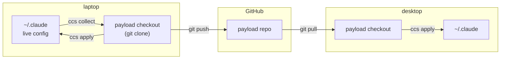

# dazzle-claude-config

[](https://pypi.org/project/dazzle-claude-config/)
[](https://github.com/DazzleML/dazzle-claude-config/releases)
[](https://www.python.org/downloads/)
[](https://www.gnu.org/licenses/gpl-3.0.html)
[](https://dazzleml.github.io/dazzle-claude-config/stats/#installs)
[](docs/platforms.md)

**Git-backed sync for your Claude Code configuration (skills, commands, agents, hooks, and `CLAUDE.md`) across every machine you work on, with credential guards on the way in and backups on every write.**

## The Problem

Your Claude Code setup is earned. Skills you refined over months, commands that encode how you actually work, a `CLAUDE.md` tuned by a hundred small corrections. All of it lives in `~/.claude` on **one** machine.

Then you get a laptop. Or a work box. Or you reinstall. So you copy the folder by hand -- and now the two drift apart, silently, because there is nothing to tell you which one is newer. Worse, `~/.claude` is not only config: it also holds `.credentials.json`, OAuth state, plugin caches, and session databases. Copy it wholesale into a git repo to "back it up" and you have published an API key. There is no history either, so when a config change makes Claude behave oddly, there is nothing to diff and nothing to roll back to.

**ccs** treats your configuration as a git repository -- a *payload* -- and moves files between that repo's checkout and your live `~/.claude`. `collect` copies a live config in, refusing credentials rather than trusting you to notice them. `apply` copies config back out, backing up every file it overwrites. When a file changed on *both* machines, neither direction is safe -- so `merge` opens your own diff tool (Beyond Compare, vimdiff, WinMerge, whatever git already knows) with both versions and a common ancestor, and installs nothing until the result is checked for content that went missing. Because a payload is just a repo, it can be yours, someone else's, or a fork of theirs.

> [!NOTE]
> **Alpha software (v0.4.0) -- working, in daily use, surfaces not frozen.** It manages my own configs across machines. The core loop (`collect` / `apply` / `merge` / `status` / `diff`, deny-list + credential scanning, backups, staged removals, selective sync) are functional; the Phase 2 set (templated settings rendering, declarative plugin installs, and one-command `ccs bootstrap` onboarding) is still a WIP, and command surfaces may change between versions until it does. `merge` resolves against a common ancestor when one can be trusted and says so plainly when it cannot; AI-assisted resolution is stubbed but not yet implemented. Please [file issues](https://github.com/DazzleML/dazzle-claude-config/issues) for anything rough. And, as with any sync tool, keep an independent copy of anything irreplaceable.

Part of the DazzleML Claude toolchain: [session-logger](https://github.com/DazzleML/claude-session-logger) records, [claude-session-backup](https://github.com/DazzleML/Claude-Session-Backup) preserves, **ccs distributes**.

## Quick Start

```bash
pip install dazzle-claude-config          # installs `ccs` (alias: dazzle-claude-config)
```

Python 3.10+, stdlib only, git is the sole external dependency.

**Try a config without committing to one.** [dazzle-claude-code-config](https://github.com/DazzleML/dazzle-claude-code-config) is a public collection (skills, commands, and agents for structured design analysis, postmortems, human test checklists, and multi-agent consultation) and it is a working payload repo you can point ccs at right now:

```bash
git clone https://github.com/DazzleML/dazzle-claude-code-config ~/claude/dazzle-config

ccs status --checkout-dir ~/claude/dazzle-config   # what differs? nothing is touched
ccs diff   --checkout-dir ~/claude/dazzle-config   # which files, exactly?

ccs apply --only dotclaude/skills --checkout-dir ~/claude/dazzle-config   # a slice...
ccs apply --checkout-dir ~/claude/dazzle-config                          # ...or the lot
```

`--only` takes a prefix of the path *inside the repo* (the left-hand paths `ccs diff` prints) which is why it reads `dotclaude/skills` rather than `skills`. A prefix matching nothing warns rather than silently doing nothing.

`apply` merges into your live config rather than replacing it, backs up anything it overwrites, and treats `CLAUDE.md` as seed-if-absent (so your own memory file is never clobbered). Fork it if you want to build on it; it is designed to be forked.

**Already have your own config repo:**

```bash
git clone <your-payload-repo> ~/claude/my-config
ccs status --checkout-dir ~/claude/my-config
ccs apply  --checkout-dir ~/claude/my-config
```

**Starting from the config you already have on this machine** -- see [Turning your current config into a payload](#turning-your-current-config-into-a-payload) for the four commands that package `~/.claude` into a repo.

Then, day to day:

```bash
git -C <checkout> pull        # what your other machines sent (ccs status says when this is due)
ccs status                    # what differs, and which side owns each change
ccs merge                     # files that changed on BOTH sides -- your diff tool decides
ccs apply                     # the rest: checkout INTO the live tree (originals backed up)
#   ... work ...
ccs collect                   # live config INTO the checkout (credentials refused)
git -C <checkout> commit -am "config: ..." && git push
```

`apply` and `collect` are one-way copies, so they **refuse** a file that changed on both sides rather than picking a winner -- that is what `merge` is for -- and each **skips** a file the other verb owns (live ahead: nothing to apply; checkout ahead: nothing to collect), saying why. `ccs status --long` shows which commit each side still equals, so the call is checkable, and `ccs diff <path> --difftool 3` shows that commit as the middle pane of your merge tool. Steps 1 and 6 are plain git; ccs does not wrap them.

**[The full loop, step by step, with what each step guarantees →](docs/sync-loop.md)**

## Usage

`ccs status` answers "am I in sync?" across all three legs -- your live config vs the checkout, the checkout vs its remote, and any uncommitted work in the checkout:

```
checkout  ~/claude/dazzle-claude-code-config
          on main, in sync with origin/main
compared  83 files across 11 entries of config
          ~/.claude
          ~/claude

protected (1 file kept out of sync on purpose -- matches a deny rule, so ccs will not copy it in either direction)
  bin/gpg-loopback.sh

status: clean -- your live config and the checkout match; nothing to collect, nothing to apply
```

Output is colorized on a TTY (and plain when piped, or with `--no-color` / `NO_COLOR`).

`collect` and `apply` both support `--dry-run` and `--only <prefix>`; `apply` also has `--sync-removals` (staged to the backup dir -- nothing is ever deleted in place). Options work before or after the verb.

### Sending part of a config, and not sending the rest

`--only` scopes a run to one slice, which matters most when the checkout is a repo you *publish*. There a `collect` does not merely copy a file, it stages it for the world, and the risk is not the file you meant to send but the one you forgot you had.

Two settings in `ccs-manifest.json` cover that, and they do different jobs:

```jsonc
"collect_exclude": ["commands/t-*.md"],  // never syncs, either direction
"hold_additions": true                   // update tracked files; do not add new ones
```

`collect_exclude` names content you already know must stay out. `hold_additions` guards the file you *haven't* thought of: with it set, `collect` updates what the checkout already tracks but will not create anything new without `--add`, and it names everything it held back. An exclusion list is a promise someone has to keep current; this is not.

It defaults to off, so a private payload you sync with yourself behaves as it always has. The first `collect` against an entry the checkout carries nothing for is treated as adoption and its files are added regardless -- otherwise a first run would be a silent no-op.

## Where things live

ccs moves files between exactly three locations. The distinction that matters: **your live config is what Claude Code reads; the checkout is a git clone that Claude Code never looks at.**

| | Default location | Who reads it | How to point elsewhere |
|---|---|---|---|
| **Live config** | `~/.claude` | Claude Code, every session | `CLAUDE_CONFIG_DIR` env, or `--claude-dir` |
| **User territory** | `~/claude` | you -- notes, backups, and where checkouts land | `--user-claude` |
| **Payload checkout** | `~/claude/dazzle-claude-code-config` | ccs and git -- **not** Claude Code | `CCS_CHECKOUT_DIR` env, or `--checkout-dir` |

The **payload checkout** is an ordinary `git clone` of a *config payload repo*: a repository whose contents are skills, commands, agents, hooks, and a `CLAUDE.md`. Editing files there changes nothing until you run `ccs apply`. That indirection is the whole point. It gives your config a place to be versioned, reviewed, conflict-resolved, and shared, without a half-finished edit reaching a live session.



ccs owns the vertical hops (live ↔ checkout, guarded and backed up). Git owns the horizontal ones (checkout ↔ GitHub ↔ your other machines). No merge logic lives in ccs -- a conflict between two machines is an ordinary git conflict you resolve in the checkout with your normal tools.

### Turning your current config into a payload

You already have a `~/.claude` full of work. To package it:

```bash
gh repo create my-claude-config --private          # or make the repo in the web UI
git clone <that repo> ~/claude/my-config
cd ~/claude/my-config

mkdir skills commands agents                       # the surfaces you want tracked
touch CLAUDE.md                                    # only if you want your memory synced

ccs collect --checkout-dir ~/claude/my-config      # copies your live config in, guarded
git add -A && git commit -m "my config" && git push
```

The empty directories are how you say *what* to track: `collect` fills in each surface you created and ignores the ones you didn't. Nothing is copied blind -- the deny-list and credential scan run on the way in, and anything refused is reported rather than silently skipped, so `.credentials.json`, `settings.local.json`, plugin state, and any file containing a credential-shaped token stay out of the repo. Read the `collect` output before you commit; it is the last cheap moment to notice a surprise.

Run `ccs collect` from then on whenever you change your live config, and commit. There is no manifest to write unless you want one -- the implicit layout above is enough for most people.

### Whose config is in the checkout?

Any repo that holds config. That is the interesting part:

- **Your own** (the main use case) -- a private repo you push from one machine and pull on the next. Your config follows you.
- **Someone else's, read-only** -- point a checkout at a public collection such as [dazzle-claude-code-config](https://github.com/DazzleML/dazzle-claude-code-config) and `ccs apply` to try the "Dazzle" skills collection. `--only <prefix>` takes a slice instead of everything.
- **A fork of someone else's** -- start from a collection you like, then `ccs collect` your own changes on top and push to your fork. Theirs becomes yours, and you can still pull their updates.

Nothing stops you keeping several checkouts side by side and pointing ccs at whichever you want, as they are just directories:

```bash
ccs diff  --checkout-dir ~/claude/someones-collection                  # what would change?
ccs apply --checkout-dir ~/claude/someones-collection --only skills/   # borrow just their skills
ccs status --checkout-dir ~/claude/my-config                           # back to yours
```

`apply` copies *into* your live tree rather than swapping it, so borrowing from a second collection merges on top of what you have (originals backed up first, as always). Named profiles with a single active set -- `ccs use <name>` -- are a [tracked idea](https://github.com/DazzleML/dazzle-claude-config/issues/8), not a current feature; today, `--only` plus your own payload as the source of truth is the way to stay in control.

Set the one you use daily and stop typing the flag:

```bash
export CCS_CHECKOUT_DIR=~/claude/my-config     # POSIX (add to your shell profile)
setx CCS_CHECKOUT_DIR C:\src\my-config         # Windows (applies to new shells)
```

Precedence: `--checkout-dir` > `CCS_CHECKOUT_DIR` > the default above.

A payload repo needs no special structure. If it has a `ccs-manifest.json`, that file declares exactly what syncs where. If it does not, ccs treats a repo that *looks like* a `~/.claude` directory (root-level `CLAUDE.md`, `skills/`, `commands/`, `agents/`...) as one -- so a repo someone made by pushing their config folder as-is just works.

## How it works

- **Manifest-driven allowlist**: the payload repo's `ccs-manifest.json` declares what syncs where (territories, per-entry strategy: `copy`, `seed-if-absent`, `render`, `plugins`). Nothing outside the manifest ever moves.
- **Secrets are structurally fenced**: a hard deny-list (`.credentials.json`, `.claude.json`, `settings.local.json`, databases, plugin caches...) refuses files even if listed, and collect scans content for credential shapes (`sk-ant-`, `ghp_`, AWS keys, private-key headers...) -- refusals are reported, never silent.
- **Git is the merge arena**: multi-machine conflicts are ordinary git conflicts in the checkout; `apply` refuses while conflicts are unresolved. `ccs` contains no merge logic and exposes no branch operations.
- **The home repo is untouchable**: if your home directory is itself a git repository (e.g. managed by claude-session-backup), `ccs` structurally refuses to operate on it.
- **Nothing is destroyed**: every overwrite is preceded by a timestamped backup under `~/claude/backups/ccs/`; removals are staged there, never deleted in place.
- **Index verification**: files copied into the checkout are checked against git's ignore/exclude mechanism, so a machine-level exclude can never silently drop config from the payload.

## Roadmap

`render` (templated settings with per-OS/per-machine overlays), declarative plugin install, and `ccs bootstrap <payload-url>` (one-command machine onboarding) land in Phase 2 -- see the pinned [Roadmap issue](https://github.com/DazzleML/dazzle-claude-config/issues/4).

## Contributing

Contributions welcome! Please open an issue or submit a pull request.

See **[CONTRIBUTING.md](CONTRIBUTING.md)** for:
- Development setup (`pip install -e ".[dev]"`)
- Running the test suite and human test checklists (`tests/checklists/`)
- Version management with `sync-versions.py`
- Pull request checklist

Like the project?

[](https://www.buymeacoffee.com/djdarcy)

## Related Projects

- [dazzle-claude-code-config](https://github.com/DazzleML/dazzle-claude-code-config) - A public collection of Claude Code skills, commands, agents, and settings -- a ready-made payload repo to point ccs at, or fork as your own
- [claude-session-logger](https://github.com/DazzleML/claude-session-logger) - Real-time per-session tool/conversation logging; its session naming and state-file conventions are part of the config surface ccs syncs
- [claude-session-backup](https://github.com/DazzleML/Claude-Session-Backup) - Backs up and restores Claude Code session history; the preservation half of the toolchain ccs distributes into

## License

dazzle-claude-config, Copyright (C) 2026 Dustin Darcy

Licensed under the [GNU General Public License v3.0](https://www.gnu.org/licenses/gpl-3.0.html) (GPL-3.0) -- see [LICENSE](LICENSE)
