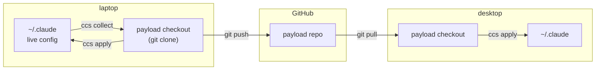

# dazzle-claude-config

[](https://pypi.org/project/dazzle-claude-config/)
[](https://github.com/DazzleML/dazzle-claude-config/releases)
[](https://www.python.org/downloads/)
[](https://www.gnu.org/licenses/gpl-3.0.html)
[](https://dazzleml.github.io/dazzle-claude-config/stats/#installs)
[](docs/platforms.md)

**ccs** -- sync Claude Code configuration across machines.

> **ccs is alpha.** It works for real daily use (it manages its maintainers' own configs), but surfaces may change between versions while the Phase 2 feature set (settings rendering, plugin installs, guided bootstrap) lands. As with any sync tool, keep independent backups of anything irreplaceable.

Your global `CLAUDE.md`, agents, skills, commands, hooks, and settings live in a git "payload" repo (yours is private; GitHub is the distribution area). `ccs` moves config between that repo's checkout and your live `~/.claude` + `~/claude` directories -- guarded, backed up, and never touching your home directory's own git repository.

Part of the DazzleML Claude toolchain: [session-logger](https://github.com/DazzleML/claude-session-logger) records, [claude-session-backup](https://github.com/DazzleML/Claude-Session-Backup) preserves, **ccs distributes**.

## Install

```bash
pip install dazzle-claude-config
```

Installs the `ccs` command (alias: `dazzle-claude-config`). Python 3.10+, stdlib only.

## Usage

```bash
git clone <your-payload-repo> ~/claude/<payload-name>   # once per machine

ccs status     # three-way drift report (live vs checkout vs remote); exit 1 = drift
ccs diff       # per-file details
ccs collect    # live config INTO the checkout (secrets refused + reported)
ccs apply      # checkout config INTO the live tree (originals backed up first)
```

`ccs status` answers "am I in sync?" across all three legs -- your live config vs the checkout, the checkout vs its remote, and any uncommitted work in the checkout:

```
checkout  ~/claude/dazzle-claude-code-config
          on main, in sync with origin/main
compared  83 files across 11 entries of config
          ~/.claude
          ~/claude

protected (1 file kept out of sync on purpose -- matches a deny rule, so ccs will not copy it in either direction)
  bin/gpg-loopback.sh

status: clean -- your live config and the checkout match; nothing to collect, nothing to apply
```

Output is colorized on a TTY (and plain when piped, or with `--no-color` / `NO_COLOR`).

`collect` and `apply` support `--dry-run`. `apply` supports `--only <prefix>` and `--sync-removals` (staged to the backup dir -- nothing is ever deleted in place). Options work before or after the verb.

## Where things live

ccs moves files between exactly three locations. The distinction that matters: **your live config is what Claude Code reads; the checkout is a git clone that Claude Code never looks at.**

| | Default location | Who reads it | How to point elsewhere |
|---|---|---|---|
| **Live config** | `~/.claude` | Claude Code, every session | `CLAUDE_CONFIG_DIR` env, or `--claude-dir` |
| **User territory** | `~/claude` | you -- notes, backups, and where checkouts land | `--user-claude` |
| **Payload checkout** | `~/claude/dazzle-claude-code-config` | ccs and git -- **not** Claude Code | `CCS_CHECKOUT_DIR` env, or `--checkout-dir` |

The **payload checkout** is an ordinary `git clone` of a *config payload repo*: a repository whose contents are skills, commands, agents, hooks, and a `CLAUDE.md`. Editing files there changes nothing until you run `ccs apply`. That indirection is the whole point -- it gives your config a place to be versioned, reviewed, conflict-resolved, and shared, without a half-finished edit reaching a live session.



ccs owns the vertical hops (live <-> checkout, guarded and backed up). Git owns the horizontal ones (checkout <-> GitHub <-> your other machines). No merge logic lives in ccs -- a conflict between two machines is an ordinary git conflict you resolve in the checkout with your normal tools.

### Turning your current config into a payload

You already have a `~/.claude` full of work. To package it:

```bash
gh repo create my-claude-config --private          # or make the repo in the web UI
git clone <that repo> ~/claude/my-config
cd ~/claude/my-config

mkdir skills commands agents                       # the surfaces you want tracked
touch CLAUDE.md                                    # only if you want your memory synced

ccs collect --checkout-dir ~/claude/my-config      # copies your live config in, guarded
git add -A && git commit -m "my config" && git push
```

The empty directories are how you say *what* to track: `collect` fills in each surface you created and ignores the ones you didn't. Nothing is copied blind -- the deny-list and credential scan run on the way in, and anything refused is reported rather than silently skipped, so `.credentials.json`, `settings.local.json`, plugin state, and any file containing a credential-shaped token stay out of the repo. Read the `collect` output before you commit; it is the last cheap moment to notice a surprise.

Run `ccs collect` from then on whenever you change your live config, and commit. There is no manifest to write unless you want one -- the implicit layout above is enough for most people.

### Whose config is in the checkout?

Any repo that holds config. That is the interesting part:

- **Your own** (the main use case) -- a private repo you push from one machine and pull on the next. Your config follows you.
- **Someone else's, read-only** -- point a checkout at a public collection such as [dazzle-claude-code-config](https://github.com/DazzleML/dazzle-claude-code-config) and `ccs apply` to try their skills. `--only <prefix>` takes a slice instead of everything.
- **A fork of someone else's** -- start from a collection you like, then `ccs collect` your own changes on top and push to your fork. Theirs becomes yours, and you can still pull their updates.

Nothing stops you keeping several checkouts side by side and pointing ccs at whichever you want -- they are just directories:

```bash
ccs diff  --checkout-dir ~/claude/someones-collection                  # what would change?
ccs apply --checkout-dir ~/claude/someones-collection --only skills/   # borrow just their skills
ccs status --checkout-dir ~/claude/my-config                           # back to yours
```

`apply` copies *into* your live tree rather than swapping it, so borrowing from a second collection merges on top of what you have (originals backed up first, as always). Named profiles with a single active set -- `ccs use <name>` -- are a [tracked idea](https://github.com/DazzleML/dazzle-claude-config/issues/8), not a current feature; today, `--only` plus your own payload as the source of truth is the way to stay in control.

Set the one you use daily and stop typing the flag:

```bash
export CCS_CHECKOUT_DIR=~/claude/my-config     # POSIX (add to your shell profile)
setx CCS_CHECKOUT_DIR C:\src\my-config         # Windows (applies to new shells)
```

Precedence: `--checkout-dir` > `CCS_CHECKOUT_DIR` > the default above.

A payload repo needs no special structure. If it has a `ccs-manifest.json`, that file declares exactly what syncs where. If it does not, ccs treats a repo that *looks like* a `~/.claude` directory (root-level `CLAUDE.md`, `skills/`, `commands/`, `agents/`...) as one -- so a repo someone made by pushing their config folder as-is just works.

## How it works

- **Manifest-driven allowlist**: the payload repo's `ccs-manifest.json` declares what syncs where (territories, per-entry strategy: `copy`, `seed-if-absent`, `render`, `plugins`). Nothing outside the manifest ever moves.
- **Secrets are structurally fenced**: a hard deny-list (`.credentials.json`, `.claude.json`, `settings.local.json`, databases, plugin caches...) refuses files even if listed, and collect scans content for credential shapes (`sk-ant-`, `ghp_`, AWS keys, private-key headers...) -- refusals are reported, never silent.
- **Git is the merge arena**: multi-machine conflicts are ordinary git conflicts in the checkout; `apply` refuses while conflicts are unresolved. `ccs` contains no merge logic and exposes no branch operations.
- **The home repo is untouchable**: if your home directory is itself a git repository (e.g. managed by claude-session-backup), `ccs` structurally refuses to operate on it.
- **Nothing is destroyed**: every overwrite is preceded by a timestamped backup under `~/claude/backups/ccs/`; removals are staged there, never deleted in place.
- **Index verification**: files copied into the checkout are checked against git's ignore/exclude mechanism, so a machine-level exclude can never silently drop config from the payload.

## Roadmap

`render` (templated settings with per-OS/per-machine overlays), declarative plugin install, and `ccs bootstrap <payload-url>` (one-command machine onboarding) land in Phase 2 -- see the pinned [Roadmap issue](https://github.com/DazzleML/dazzle-claude-config/issues/4).

## Contributing

Contributions welcome! Please open an issue or submit a pull request.

See **[CONTRIBUTING.md](CONTRIBUTING.md)** for:
- Development setup (`pip install -e ".[dev]"`)
- Running the test suite and human test checklists (`tests/checklists/`)
- Version management with `sync-versions.py`
- Pull request checklist

Like the project?

[](https://www.buymeacoffee.com/djdarcy)

## Related Projects

- [dazzle-claude-code-config](https://github.com/DazzleML/dazzle-claude-code-config) - A public collection of Claude Code skills, commands, agents, and settings -- a ready-made payload repo to point ccs at, or fork as your own
- [claude-session-logger](https://github.com/DazzleML/claude-session-logger) - Real-time per-session tool/conversation logging; its session naming and state-file conventions are part of the config surface ccs syncs
- [claude-session-backup](https://github.com/DazzleML/Claude-Session-Backup) - Backs up and restores Claude Code session history; the preservation half of the toolchain ccs distributes into

## License

dazzle-claude-config, Copyright (C) 2026 Dustin Darcy

Licensed under the [GNU General Public License v3.0](https://www.gnu.org/licenses/gpl-3.0.html) (GPL-3.0) -- see [LICENSE](LICENSE)
